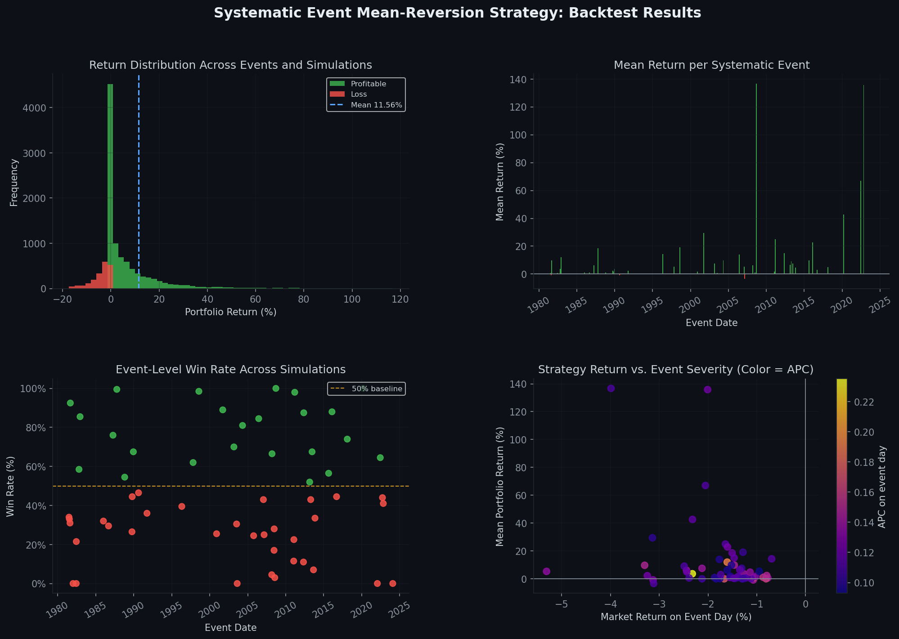

# Systematic Event Mean-Reversion Backtester

This project implements a backtesting framework for studying whether broad,
market-wide stress events create temporary stock-level mispricing followed by 
mean reversion. The strategy identifies systematic events using cross-sectional
correlation, constructs randomized portfolios from stocks affected by the event,
and evaluates the resulting return distribution through Monte Carlo simulation.

The code is intended as a research tool rather than a live trading system. It
emphasizes transparent assumptions, reproducible sampling, and interpretable
summary statistics.

## Results Preview

### Backtest Ovewview



### Holding Period Analysis


## Quick Start

Install the required packages:

```bash
pip install pandas numpy scipy matplotlib
```

Run the backtest on a wide price file, where each row is a date and each column
after the date column is a ticker:

```bash
python3 systematic_event_backtest.py --file prices.csv
```

Run the backtest on a long price file, where each row is a ticker-date
observation:

```bash
python3 systematic_event_backtest.py --file prices.csv \
    --date-col Date --ticker-col Ticker --price-col Close
```

Generate the figures after the backtest writes the results and summary CSVs:

```bash
python3 plot_results.py
```

## Methodology

### 1. Systematic Event Definition

A systematic event is defined as a stock market period on which individual stocks move
together because of a common market factor rather than only firm-specific factors.
Examples include monetary policy announcements, macroeconomic shocks, financial
crises, and geopolitical events.

The empirical signal used here is Average Pairwise Correlation (APC), computed
over a rolling window of daily returns:

```text
APC_t = (2 / (N(N - 1))) * sum_{i < j} corr(r_i, r_j)_t
```

where `corr(r_i, r_j)_t` is the Pearson correlation between stocks `i` and `j`
over the rolling window ending on date `t`.

APC is useful because it is an intuitive cross-sectional measure of common
movement. When APC rises sharply, a larger share of stock-level variation is
being explained by a market-wide component. It is also computationally practical:
estimating APC on a fixed subsample is much less expensive than repeatedly
estimating a full correlation matrix or principal component decomposition for a
large equity universe.

An event date must satisfy all of the following filters:

| Condition | Purpose |
|---|---|
| APC exceeds its expanding historical quantile threshold | Identifies unusually high cross-sectional co-movement using only past information |
| Equal-weighted market return is below a volatility-adjusted floor | Restricts the sample to economically meaningful downside events |
| A minimum number of stocks have valid return observations | Reduces noise from sparse data coverage |
| Event windows do not overlap | Avoids counting one prolonged stress episode as several independent events |

### 2. Trading Rule

For each accepted event, the simulation proceeds as follows:

1. Estimate an event window that begins on the trigger date and ends when APC
   falls back below its expanding threshold, subject to the maximum holding
   period.
2. Identify stocks with positive estimated market beta and a negative systematic
   return component on the trigger day.
3. Randomly sample a fixed-size portfolio from this eligible universe.
4. During the event window, add capital only on qualifying negative stock-day
   returns. A z-score filter requires the stock's drop to be large relative to
   its own recent volatility.
5. Scale capital by a Composite Severity Score based on APC excess, market
   decline severity, and the fraction of stocks down.
6. Exit all open positions at the event-window end date.

The Monte Carlo structure repeats the portfolio draw many times for each event.
This produces a distribution of outcomes rather than a single path that might
depend heavily on one arbitrary stock sample.

### 3. Statistical Design

The main statistical choices are:

| Design Choice | Rationale |
|---|---|
| Expanding APC threshold | Avoids look-ahead bias in event identification |
| Volatility-adjusted market drop filter | Makes event detection comparable across calm and volatile regimes |
| Randomized portfolios | Estimates the distribution of feasible outcomes for each event |
| Z-score calibration | Selects a drop-size threshold based on observed forward returns net of transaction-cost assumptions |
| Non-overlapping event windows | Keeps the event sample closer to independent observations |

Because the z-score threshold is calibrated in sample, the resulting performance
should be interpreted as exploratory evidence. A more rigorous research design
would reserve a holdout period or use a rolling walk-forward calibration.

### 4. Computational Notes

The code is written for large daily equity panels. To keep the backtest
tractable:

| Bottleneck | Implementation Choice |
|---|---|
| Rolling APC on a large stock universe | Estimate APC on a reproducible random subsample |
| Repeated date alignment | Convert aligned price and return data to NumPy arrays inside simulation loops |
| Event detection | Apply vectorized filters before the event-window loop |
| Monte Carlo simulation | Restrict loops to the small eligible event windows and selected portfolios |

### 5. Key Parameters

| Parameter | Default | Interpretation |
|---|---:|---|
| `--window` | 60 | Rolling window, in trading days, used to estimate APC |
| `--apc-threshold` | 0.65 | Expanding quantile used to define an APC spike |
| `--cooldown` | 30 | Minimum spacing between accepted events |
| `--max-hold` | 756 | Maximum event-window length, approximately three trading years |
| `--portfolio-size` | 10 | Number of stocks sampled in each simulated portfolio |
| `--n-simulations` | 200 | Number of random portfolio draws per event |
| `--apc-sample` | 50 | Number of stocks used in the APC approximation |
| `--mkt-drop-vol-mult` | 1.5 | Required market decline in rolling standard-deviation units |
| `--round-trip-cost` | 0.002 | Transaction-cost assumption used during z-score calibration |

### 6. Output Files

| File | Contents |
|---|---|
| `*_results.csv` | One row per event-simulation pair, including invested capital, P&L, return, tickers, and holding period |
| `*_summary.csv` | Event-level statistics such as mean return, median return, win rate, duration, and Sharpe ratio |
| `backtest_overview.png` | Four-panel overview of return distributions and event-level performance |
| `backtest_holding.png` | Holding-period distribution and return-versus-duration scatter plot |

### 7. Interpreting Results

A positive and statistically significant mean return is consistent with the
hypothesis that broad downside events generate temporary dislocations that later
partially reverse. The win rate indicates how often sampled portfolios are
profitable, while the event-level dispersion shows whether performance is
concentrated in a small number of episodes or appears more broadly across the
sample.

The APC and market-return scatter plot is especially useful for checking whether
more severe systematic events are associated with stronger subsequent rebounds.
If the relationship is weak or negative, the mean-reversion mechanism may be
less reliable than the aggregate return statistics suggest.

### 8. Limitations and Extensions

This framework has several important limitations:

- Transaction costs are modeled only in the z-score calibration step; full
  execution costs, bid-ask spreads, and market impact are not included in the
  simulated P&L.
- Survivorship bias can materially overstate results if the dataset excludes
  delisted firms.
- The z-score threshold is selected in sample, so out-of-sample validation is
  necessary before drawing stronger conclusions.
- The strategy uses an equal-weighted market proxy; sector or factor controls
  may improve event classification.
- Liquidity constraints are not modeled, which matters especially for smaller
  stocks.

Possible extensions include sector-neutral sampling, volatility-targeted
position sizing, walk-forward calibration, VIX-conditioned event filters, and
separate analysis by market regime.

## Data Availability

The raw daily stock price dataset (all_stock_data.csv) is not included in this repository because of file size.


## Example Research Run

```bash
python3 systematic_event_backtest.py --file all_stock_data.csv \
    --date-col Date --ticker-col Ticker --price-col Close

python3 plot_results.py
```

## Disclaimer

This project is for academic and research purposes only. It is not financial advice or a live trading system.

