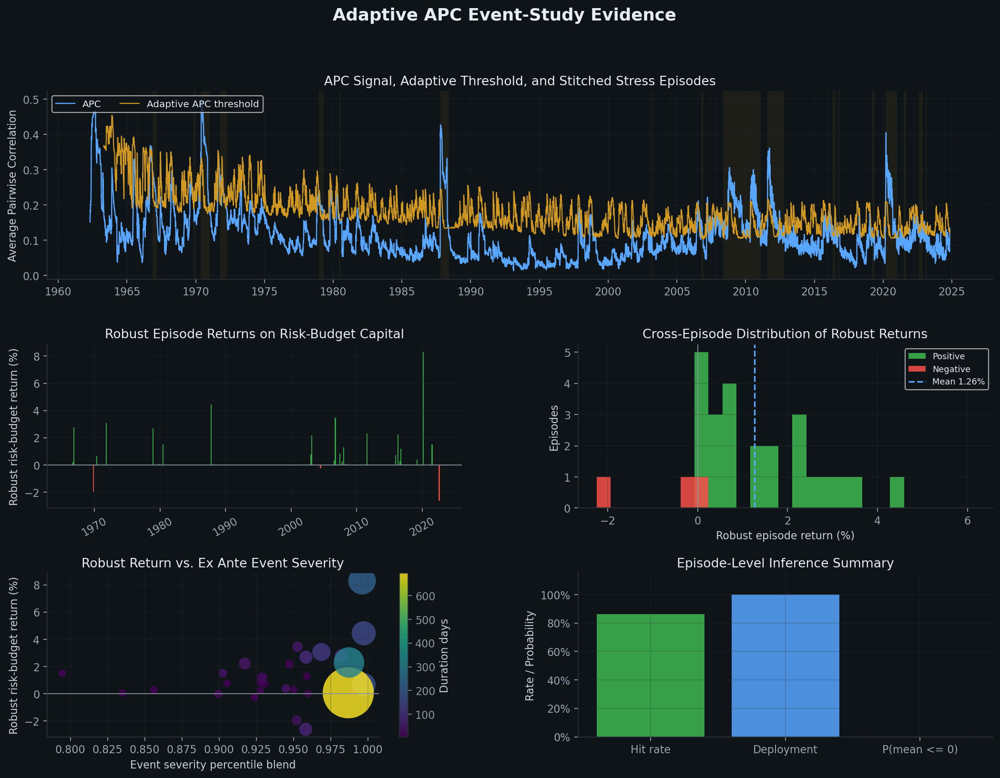
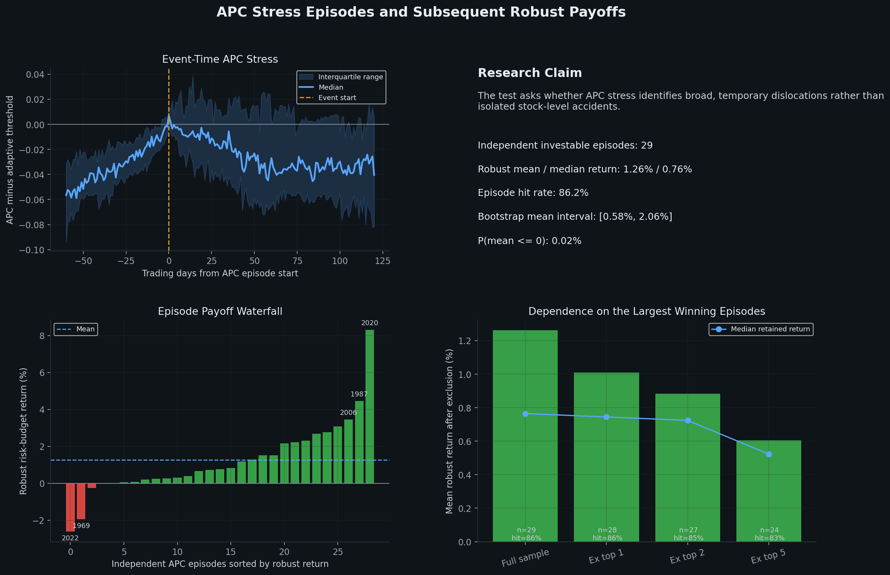
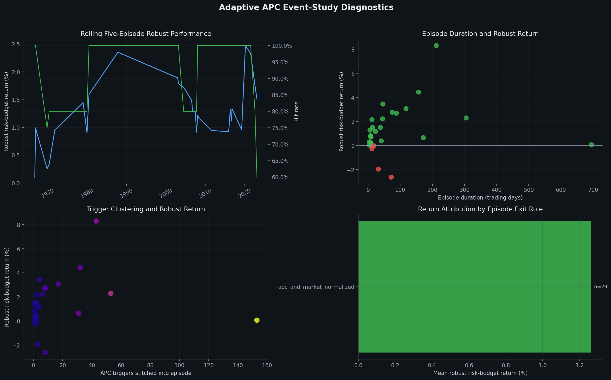

# Systematic Event Backtester Research

This repository tests a simple empirical idea from market microstructure and portfolio economics: during broad market selloffs, unusually high **Average Pairwise Correlation (APC)** may indicate a common shock rather than purely firm-specific information. The project asks whether selected stocks affected by those episodes subsequently mean-revert enough to generate positive, risk-budgeted event returns after transaction costs.

The framework is written as a research backtest, not as a live trading system or investment recommendation.

## Visual Summary

The three figures below are generated by `plot_results.py` after running the backtest. The overview shows the APC signal and episode-level return distribution, the story plot summarizes the core research claim and outlier dependence, and the diagnostics plot checks whether results are stable across time, duration, and stitched-trigger intensity.

<p align="center">
  
</p>

<p align="center"><em>Overview:</em> APC spikes above an adaptive threshold define stress regimes; the lower panels show whether those regimes are followed by positive robust event returns.</p>

<p align="center">
  
</p>

<p align="center"><em>Research story:</em> the event-time panel shows APC stress around episode starts, while the payoff and exclusion panels check whether the result survives outside the largest winning events.</p>

<p align="center">
  
</p>

<p align="center"><em>Diagnostics:</em> rolling performance, event duration, trigger clustering, and exit-rule attribution are used to decide whether the signal looks systematic or driven by a few unusual observations.</p>

## Main Result in the Current Robust Run

The latest run identifies **29 independent stitched APC episodes** between 1965 and 2023. On a robust risk-budget basis, the mean episode return is **1.26%**, the median episode return is **0.76%**, and the event hit rate is **86.2%**. The bootstrap interval for the mean robust return is **[0.58%, 2.06%]**, with an estimated **0.02%** probability that the mean is less than or equal to zero.

I would interpret this as promising research evidence, not as proof of a tradable anomaly. The sample is still small at the independent-event level, and the next test should compare the APC strategy against simpler recovery benchmarks such as buying the broad market, buying equal-weighted losers, or using sector-neutral loser baskets over the same windows.

## Why This Version Is More Conservative

The first version of this project produced attractive aggregate returns, but it had several event-study risks that could make the results look better than they really were. This version tries to address those issues directly.

| Research issue | Why it matters | Current treatment |
|---|---|---|
| Entry thresholds calibrated on realized outcomes | Can create look-ahead bias or overfit | Entry cutoffs are estimated only from prior downside-return distributions |
| Repeated triggers inside the same crisis | Can double-count a single macro event | APC triggers are stitched into non-overlapping stress episodes |
| Long windows around 2008 and 2020 | Can accidentally become a long-only recovery trade | Episodes define regimes, but each stock lot exits independently |
| Simulation rows treated as evidence | Monte Carlo draws are not independent market events | Inference is done at the stitched-episode level |
| Single-stock jackpots | Can dominate the average while saying little about systematic dislocation | Lot payoffs are capped using point-in-time prior cross-sectional tails |
| Static parameters | May fit one volatility regime and fail in another | Detection, sizing, horizon, and exit rules adapt to market state |

## Methodology

### 1. Market State

For each date, the script builds a point-in-time market state from the cross-section of daily stock returns. The state includes the equal-weighted market return, market volatility ratio, valid-stock coverage, the fraction of stocks down, and a volatility-regime percentile.

All adaptive thresholds are estimated from information available before the date being tested.

### 2. Average Pairwise Correlation

A systematic event is defined as a stock market period on which individual stocks move
together because of a common market factor rather than only firm-specific factors.
Examples include monetary policy announcements, macroeconomic shocks, financial
crises, and geopolitical events.

The empirical signal used here is Average Pairwise Correlation (APC). APC is the average of all pairwise correlations across the stock return panel over a rolling window:

```text
APC_t = (2 / (N * (N - 1))) * sum corr(r_i, r_j)
```

The APC lookback adapts to the volatility regime. High-volatility markets use shorter lookbacks, while calmer markets use longer lookbacks. The stock sample is deterministic and coverage based, so changes in the APC signal come from the data and the rule, not from random subsampling.

### 3. Stitched Stress Episodes

An event starts when four conditions hold at the same time:

| Condition | Adaptive source |
|---|---|
| APC is above its expanding threshold | Prior APC distribution and volatility regime |
| The market return is in its downside tail | Prior market-return distribution |
| A broad fraction of stocks is down | Prior breadth distribution |
| Enough securities have valid observations | Prior coverage distribution |

Nearby triggers are then stitched into one episode if the market has not normalized or if the next trigger is close enough to be part of the same unresolved stress regime. This is important because a crisis such as 2008 or 2020 should not be counted as dozens of independent observations.

### 4. Trading Simulation

Within each stitched episode, the strategy simulates stock-selection uncertainty:

1. Estimate adaptive market beta for each stock.
2. Select stocks with positive beta that are negatively affected by the systematic shock.
3. Set portfolio size from the eligible universe and selloff breadth.
4. Add capital only on qualifying negative stock-days.
5. Require the drop to exceed a z-score threshold learned from prior downside moves.
6. Size entries by event severity, relative z-score, and relative volatility.
7. Exit each lot independently after local normalization, an adaptive horizon, or the episode end.
8. Cap unusually large positive lot payoffs using prior cross-sectional return tails.
9. Subtract round-trip transaction costs.

No threshold is selected by maximizing realized forward returns.

### 5. Return Measurement

The headline performance metric is `headline_return_pct`, a robust trimmed mean of episode-level risk-budget returns. Raw mean returns and deployed-capital returns are kept as diagnostics, but they are not the main evidence because they can be more sensitive to sparse deployment and outlier stock moves.

The reason for using a robust event-level return is mathematical as much as practical: the independent observation is the market-stress episode, not every simulated portfolio draw and not every individual lot.

### 6. Statistical Inference

The report computes inference across stitched episodes. The generated research report includes:

- number of detected events and investable events
- deployment rate
- robust mean and median event returns
- event hit rate
- event-level t-statistic
- bootstrap confidence interval for the robust mean
- bootstrap probability that the robust mean is less than or equal to zero
- diagnostic counts for payoff caps and lot exit reasons

## Quick Start

Install the required packages:

```bash
pip install pandas numpy scipy matplotlib
```

Run the backtest on a wide price file where the first column is the date and each remaining column is a ticker:

```bash
python3 systematic_event_backtest.py \
  --file prices.csv \
  --out-prefix adaptive_apc_robust
```

Run the backtest on a long price file:

```bash
python3 systematic_event_backtest.py \
  --file prices.csv \
  --date-col Date \
  --ticker-col Ticker \
  --price-col Close \
  --out-prefix adaptive_apc_robust
```

Generate the figures:

```bash
python3 plot_results.py --prefix adaptive_apc_robust
```

## Repository Outputs

| File | Description |
|---|---|
| `*_results.csv` | Simulation-level output for each stitched episode and Monte Carlo draw |
| `*_summary.csv` | Independent episode-level performance summary |
| `*_events.csv` | Event definitions, stitching diagnostics, thresholds, duration, and severity |
| `*_daily_diagnostics.csv` | Daily APC, adaptive thresholds, market state, entry cutoffs, horizons, and payoff caps |
| `*_research_report.csv` | Compact inference table |
| `*_research_overview.png` | Broad signal, event-return distribution, and inference snapshot |
| `*_research_story.png` | Research narrative, event-time APC stress, payoff waterfall, and outlier-dependence checks |
| `*_research_diagnostics.png` | Rolling performance, duration, trigger clustering, and exit-rule diagnostics |

## Important Options

The command-line arguments are best thought of as research-governance and compute controls, not as tuned alpha parameters.

| Option | Default | Purpose |
|---|---:|---|
| `--min-history` | `252` | Minimum prior observations required before adaptive thresholds activate |
| `--apc-window-min` | `35` | Lower bound for adaptive APC and risk lookbacks |
| `--apc-window-max` | `126` | Upper bound for adaptive APC and risk lookbacks |
| `--max-apc-names` | `125` | Deterministic compute cap for APC estimation |
| `--n-simulations` | `500` | Monte Carlo portfolio draws per episode |
| `--investment` | `1.0` | Base research capital unit before severity scaling |
| `--round-trip-cost` | `0.002` | Round-trip cost as a fraction of invested capital |
| `--seed` | `7` | Reproducible random seed |

## How to Interpret Results

A strong result should have several properties at the same time:

- robust mean and median episode returns are both positive
- the raw mean does not overwhelm the robust mean
- the bootstrap interval is mostly above zero
- the hit rate is high across independent episodes
- deployment rates are reasonable
- results do not disappear after removing one or two large winners
- episode durations are consistent with temporary dislocations rather than a long-only recovery trade
- payoff caps reduce outliers without creating the entire result

If the strategy only works because of one crisis period, one very long window, or a few extreme single-name rebounds, the evidence should be treated as weak even if the aggregate return looks attractive.

## Data Requirements

Use survivorship-bias-free adjusted prices if possible. A dataset that excludes delisted firms can materially overstate mean-reversion results after market stress.

The raw daily stock price dataset is not included in this repository because of file-size and licensing constraints.

## Next Research Question

The next test should ask:

```text
Does APC add information beyond a generic market-rebound trade?
```

That means comparing the APC strategy against same-window alternatives such as buying the market, buying an equal-weighted basket of broad losers, or using sector-neutral and beta-neutral loser portfolios. This would separate APC-specific signal value from ordinary post-selloff recovery behavior.

## Example Research Run

```bash
python3 systematic_event_backtest.py \
  --file all_stock_data.csv \
  --date-col Date \
  --ticker-col Ticker \
  --price-col Close \
  --out-prefix adaptive_apc_robust

python3 plot_results.py --prefix adaptive_apc_robust
```

## Note

The full daily stock price dataset is not included in this repository due to size constraints. 
The backtest outputs included here are generated from `all_stock_data.csv`.

## Disclaimer

This project is for research and education only. It is not financial advice.

## Author

Diego Ascencio Schutz  
GitHub: @diascencio(https://github.com/diascencio)
